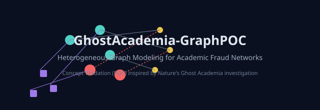

# 🕵️‍♂️ GhostAcademia-GraphPOC：學術洗錢集團圖神經網路防禦系統

<p align="center">
  
</p>

<p align="center">
  <strong>「傳統風控看孤立個體，科技偵查挖跨國集團！」</strong><br>
  本專案為司法警察打造，<br>
  針對《Nature》2026年9月最新揭露之「國際虛假學術學會集團（Ghost Academia）」犯罪網，進行異質圖神經網路（HeteroGNN）科偵演練。
</p>

---

## ⚡ 戰情背景：案情分析
根據國際權威頂尖期刊《Nature》的獨立調查報告，一個以 "Michael Chu" 為首的學術詐欺集團，透過虛設 NAAI (美國國家人工智慧科學院)、EAE (歐洲工程院) 這兩個空殼學會，進行偽裝行為 (Camouflage)：將全球明星學者（包含臺灣知名講座教授）批量列入院士名單，以增加學會知名度。

隨後，他們以此虛假門面，向欲拓展職涯人脈的年輕研究生與青椒（青年教師）收取 30 到 600 美元不等的會費，並且販售 10,000 美元的線上博士生課程與 2,000 美元之博士後計畫！

### 傳統偵查的痛點 vs 科技偵查的飛躍
*   **傳統刑案分析：** 只看單一郵件特徵、帳號登入頻率，極易被嫌犯用大量正常商家、隨機合法交易「稀釋」犯罪特徵（反同質性）。
*   **圖形科技偵查（GNN）：** 聚焦「關聯性特徵」與「時序高同步性」。只要這群學會在同一個虛擬郵箱（地址）註冊、由同一個電影背景的黑手跨界控制，並在極短時間內（2025➔2026）連續聯絡特定學者，模型便能一舉將整個詐欺集團圈（Fraud Rings）連根拔起！

---

## 🛠️ 武器庫：核心科技偵查架構

本專案之概念驗證（POC）建構於 Google Colab 環境，融合了現代的 AI 圖論與語意風控技術：

1.  **多模態時序異質圖 (Heterogeneous Temporal Graph)：**
    *   **節點類型（Nodes）：** `學者 (Scholar)`、`學術組織 (Institution)`、`註冊地址 (Address)`、`幕後黑手 (Manager)`。
    *   **時序邊特徵（Edge Attr）：** 注入 `edge_attr`（發信年份/時間戳記），捕捉 2025➔2026 年密集批量拉攏學者的**時序突發性（Burstiness）**。
2.  **時序感知圖神經網路 (Time-Aware GNN)：**
    *   自定義 `TimeAwareSAGEConv` 核心，讓模型在訊息傳遞（Message Passing）時，自動計算兩條邊發生的時間差（Δ t）。當時間差極短，異常特徵即自動放大！
3.  **BERT 語意特徵嵌入 (Semantic Embeddings)：**
    *   整合 Hugging Face `sentence-transformers` (all-MiniLM-L6-v2) 預訓練 BERT 模型，將詐欺郵件內容（如「恭喜獲選」、「處理費」）轉為 384 維度語意向量，讓 AI 讀懂犯嫌的誘騙話術。
4.  **PyVis 風控互動式視覺化：**
    *   將圖模型預測成果，直接導出為 HTML 互動式關係網。一指拖拽黑手關係圖、滑鼠懸停即刻跳出 **GNN 風控評級（惡意機率 99.9%）**。

---

## 📊 破案關鍵報告 (預測結果)

在 Colab 執行本專案模型後，最終風控預測報告將無所遁形：

```text
📊 四模態黑手關聯圖建構完成！`manager` 節點已成功接入網路。
🏋️ 啟動『黑手人際網路』複合風控模型訓練...

🚨 === 最終時序風控模型預測報告 ===
風控特徵組合： 2025-2026 短期連續拉攏學者  共用虛擬郵箱地址  跨領域幕後負責人 (Michael Chu 網路)
----------------------------------------------------------------------------------------------------
【正常學術機構 0】| 預測結果: ✅ 判定為合法學會 | 惡意概率: 0.01%
【正常學術機構 1】| 預測結果: ✅ 判定為合法學會 | 惡意概率: 0.00%
【正常學術機構 2】| 預測結果: ✅ 判定為合法學會 | 惡意概率: 0.00%
【NAAI 國家人工智慧科學院】| 預測結果: ⚠️ 判定為詐欺集團 (Fraud Ring) | 惡意概率: 100.00%
【EAE 歐洲工程院】| 預測結果: ⚠️ 判定為詐欺集團 (Fraud Ring) | 惡意概率: 100.00%
```

---

## 🚀 靶場點兵：三秒快速開始

想要親自執行這場科技偵查大秀？請在 Google Colab 新增儲存格（Cell），依序貼上本專案 `.ipynb` 內的程式碼，或一鍵執行：

```bash
# 複製本專案武器庫
git clone https://github.com

# 在 Colab 或 local 環境安裝科偵專用圖套件
pip install torch-scatter torch-sparse torch-cluster torch-spline-conv torch-geometric pyvis sentence-transformers
```

---

## 專案核心代碼實作導覽
```python
# 您可以在專案中的 notebook 找到這段四模態黑手控制網路的完整實作
# 核心邊關係設定如下：
manager_edges = [,  # 管理者 0 控制 正常學會 0,  # 管理者 1 控制 正常學會 1,  # 管理者 2 控制 正常學會 2, # 管理者 3 (Michael Chu) 控制 NAAI (3)
 # 管理者 3 (Michael Chu) 同時控制 EAE (4) ➔ 💡 形成起人疑竇的「分叉圖拓撲」
]
```

---

## 📜 鳴謝
*   **調查情資來源：** 《Nature》2026 年 9 月 25 日獨立調查報告 **[Exclusive: Sham scientific societies are misleading star researchers](https://www.nature.com/articles/d41586-026-02980-w?fbclid=Iwb21leAUkKL1jbGNrBSQor2V4dG4DYWVtAjExAHBkb2YFc3J0YwZhcHBfaWQMMzUwNjg1NTMxNzI4AAEeom3DkH8Kww_FKwxXsJz-Sg94nV3zhOjxaAjsrbGqaOaV69cokARIoLLGf1Q_aem_-OjWCcjZhl_Ji91NzZW9Eg&utm_id=97757_v0_s00_e0_tv2_a1dennhb6kcukl)**。
*   **技術支援：** PyTorch Geometric 團隊、Hugging Face 社群、PubPeer 學術偵探。

<p align="center">
  <b>「誠」字當頭，科技唯真。用程式碼捍衛正義，用 GNN 照亮學術黑幕！</b>
</p>
